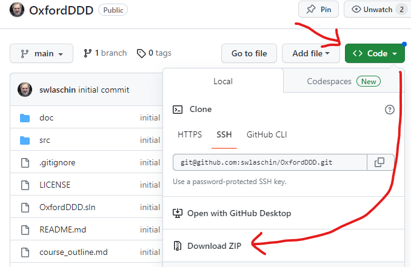

# Domain Driven Design - One Week Course

This is the git repository for the one week Domain-Driven Design (“DDD”) course given as part of Software Engineering Programme at Oxford University
([website](https://www.cs.ox.ac.uk/softeng/subjects/DDD.html)).

All documentation and code will be available via this repo. Please refresh and re-pull if the contents have changed.

Before the course starts:

* Ensure your development environment is set up (see below)
* Review the [course outline](course_outline.md)
* Please work through the prestudy material in the [prestudy.md](prestudy.md) file.


Any questions, please contact me at `scott(at)scottwlaschin.com`

----

## How to set up your development environment

We will be using F# as our development language. No prior experience with F# is needed -- the prestudy materials will cover the basics of using F# and I will explain everything else as we need it.

**1. Please install the F# compiler and an F#-friendly editor**

There are instructions at [fsharp.org](https://fsharp.org/) or [Ionide.io](https://ionide.io/Editors/Code/getting_started.html)

Installation instructions for F#:

* For Mac: https://fsharp.org/use/mac/
* For Windows: https://fsharp.org/use/windows/
* For Linux: https://fsharp.org/use/linux/

For a known-to-be F#-friendly editor, I recommend:

* Visual Studio Code (all platforms)
* [JetBrains Rider](https://www.jetbrains.com/rider/) (all platforms)
* Visual Studio (Windows and Mac).

NOTE: I prefer to change the defaults in VSCode and Visual Studio to be less distracting. A list of the settings is available in the file [vscode_setup.md](vscode_setup.md)

I personally have not used Vim and Emacs for interactive coding in F#, but here are some links on how to use them:

* Emacs: [fsharp-mode](https://github.com/fsharp/emacs-fsharp-mode)
* Vim: [Ionide support](https://ionide.io/Editors/Vim/getting_started.html) and [a blog post explaining how to use it](https://www.codesuji.com/2021/04/10/F-Vim/).

If you would prefer not install on your local system, there are a number of ways to work on a remote VM or to develop in docker container, depending on your environment and editor. For example, VS Code has excellent support for [remote development using SSH](https://code.visualstudio.com/docs/remote/ssh) and for [editing in a local docker container](https://www.howtogeek.com/devops/how-to-edit-code-in-docker-containers-with-visual-studio-code/).

**2. Clone or download this repo locally**

If you already have git installed, you can use:

```
mkdir OxfordDDD
git clone https://github.com/swlaschin/OxfordDDD
```

If you don't have git installed, you can install it using [these instructions](https://github.com/git-guides/install-git). NOTE: we will not be using the features of git in the course, so installing it is not required (see below).

If you don't want to install git, you can download a zip file from the "code" button on the github website as shown in this screenshot:



**3. Check that you can run F#**

* Open the code folder:
  * In VS Code, open the `/src` folder
  * In VisualStudio or JetBrains Rider, open the `OxfordDDD.sln` solution file, then "Solution Items"
* Open `00-HelloWorld.fsx` and follow instructions to check that F# is working

**4. Open the prestudy material**

Please work through the prestudy material in the [prestudy.md](prestudy.md) file.

----

## Directory Structure

The folders in this repository are laid out as follows

* `/src/` contains the code
* `/doc/` contains pdf documents
* `/slides/` contains the slides
* `/extra/` contains extra material not used in the course